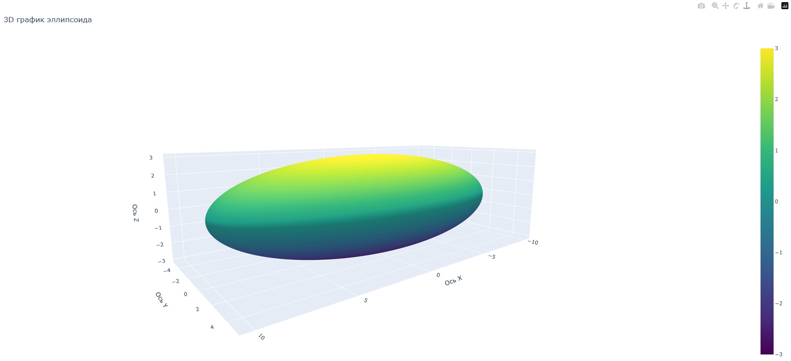

# Дипломная работа

## Тема Сравнение различных библиотек для визуализации данных: Matplotlib, Seaborn и Plotly.

## Задача: Создать набор визуализаций с использованием Matplotlib, Seaborn и Plotly, сравнить их функциональность и удобство использования.

### Автор: Кошелев Владислав Романович

## Цели и задачи:

Целью работы является сравнение библиотек Matplotlib, Seaborn и Plotly по критериям функциональности, удобства использования и визуального качества графиков.

Задачи исследования:
1. Проанализировать основные характеристики библиотек.
2. Создать визуализации с помощью каждой из библиотек.
3. Оценить визуализации по установленным критериям.

## Обзор библиотек:

**Matplotlib** — это базовая библиотека для создания статических и интерактивных графиков. Она предоставляет широкие возможности по настройке визуализаций.

**Seaborn** — это библиотека, созданная на основе Matplotlib, предлагающая более высокоуровневый интерфейс для визуализации данных. 

**Plotly** – это библиотека, которая предлагает создание интерактивных графиков и отлично подходит для веб-приложений, что делает ее популярным инструментом для презентации данных.

## Методология

Для проведения сравнительного анализа используется набор данных отдельных параметров финансовой отчетности Microsoft Corporation с 2011 по 2024 года, за основу будем брать следующие поля:
- год (year);
- выручка (earnings);
- чистая прибыль (revenue);
- валовая прибыль (gross_profit).

## Программная реализация задачи разбита на три модуля, располагается в директории main:

- Matplotlib.py
- Seaborn.py
- Plotly.py

## Пример выполниненных графиков

## Программная реализация дополнительных абстрактыных графиков, располагается в директории additional:

- Matplotlib_add.py
- Seaborn_add.py
- Plotly_add.py

## Пример выполниненных графиков

## Дополнительное представление кода и графиков, располагается в директории Colab:

- Matplotlib.ipynb
- Matplotlib_add.ipynb
- Seaborn.ipynb
- Seaborn_add.ipynb
- Plotly.ipynb
- Plotly_add.ipynb

## Заключение
**Итоги сравнительного анализа библиотек визуализации:**

Каждая библиотека (Matplotlib, Seaborn, Plotly) имеет свои сильные и слабые стороны:

**Matplotlib**: универсальная и мощная библиотека с высокой настраиваемостью, но требует больше усилий для освоения, что может затруднить использование новичками.

**Seaborn**: упрощает процесс визуализации с высокоуровневым интерфейсом и предустановленными стилями, идеальна для быстрой и эстетической визуализации статистических графиков.

**Plotly**: обладает высокой интерактивностью, подходит для задач, требующих вовлеченности пользователя, но может занять больше времени на освоение для тех, кто привык к статическим графикам.

Выбор библиотеки зависит от целей проекта: для гибкости - Matplotlib, для быстроты и эстетики - Seaborn, для интерактивности - Plotly.
