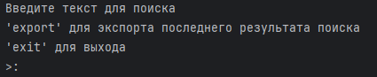
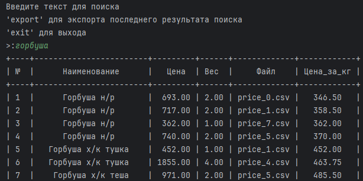
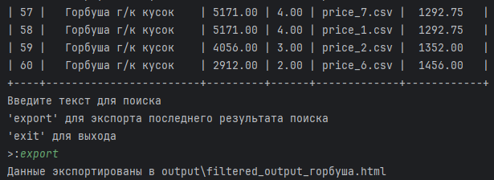
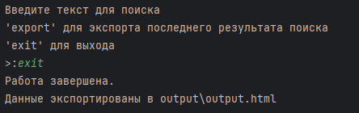
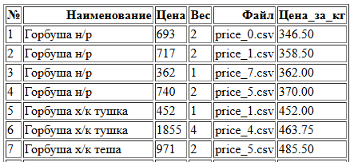
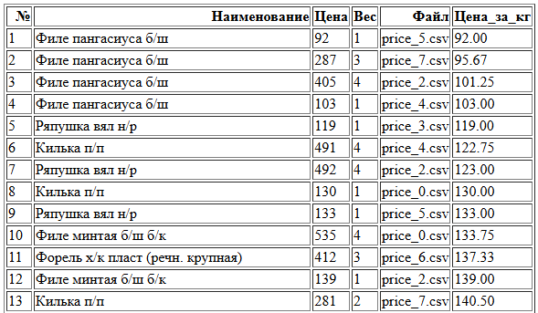

# Price Analyzer

Price Analyzer - это программа для анализа цен на продукты. Она позволяет загружать данные о ценах, выполнять поиск по названиям продуктов и экспортировать результаты в HTML-файл.

## Установка

1. Убедитесь, что у вас установлен Python 3.x.
2. Установите необходимые библиотеки, если они еще не установлены:

bash
`pip install pandas prettytable`

## Использование

1. Сначала загрузите данные о ценах в деррикторию "prise_list".
2. Запустите программу, и она предложит вам ввести текст для поиска, экспортировать результаты или выйти из программы.

### Команды

- **Введите текст для поиска**: Введите текст, чтобы найти соответствующие продукты по их названиям.
- **'export'**: Экспортирует результаты последнего поиска в HTML-файл. Если результаты отсутствуют, программа уведомит вас об этом.
- **'exit'**: Завершает работу программы и экспортирует все данные в файл `output.html`.

### Скришоты работы
`Начало работы`

`Запрос информации, ответ и экспорт`

`Выход из программы с полной выгрузкой данных`

### Экспортируемые файлы
`Экспорт после запроса`

`Экспорт всех данных`

## Функциональность

- **Поиск**: Программа ищет текст в названиях продуктов и возвращает отсортированный список найденных позиций.
- **Экспорт**: Результаты поиска можно экспортировать в HTML-файл с номерами строк и округленными значениями цен.
- **Уведомления**: Программа уведомляет пользователя о том, если данные не найдены или если не загружены данные.